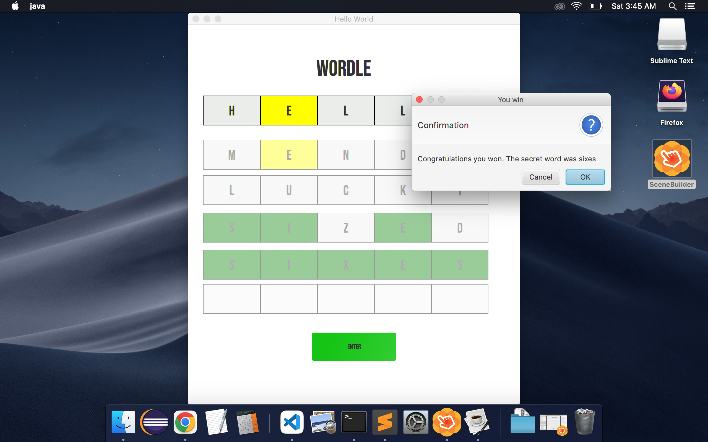
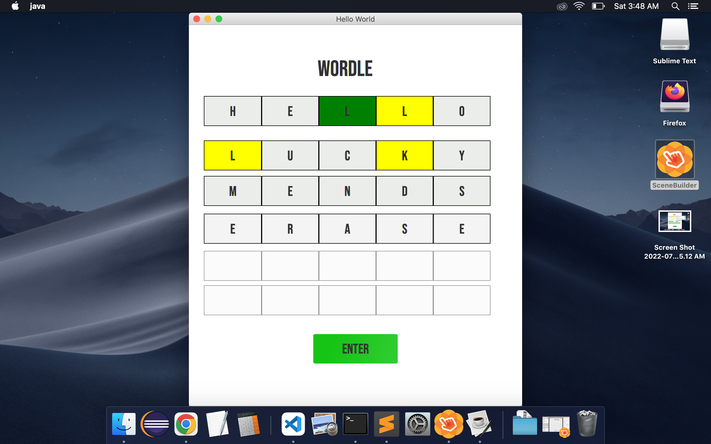

# JavaFX Wordle

## About
---

A Cross-platform Wordle application built using JavaFX.

The goal of Wordle is to try to guess a secret five letter word in six tries or less. After every guess each letter in the guess will be highlighted with a certain color. 

 Green:

  > Letter is in the word and in the correct spot. 

Yellow:

  > Letter is in the word, but not in the correct spot.

Gray:

  > Letter is not in the word. 

This project was inspired by the Official Wordle game in an attempt to replicate and improve some of the word processing algorithms using JavaFX. You can read more about Wordle [here](https://www.nytimes.com/2022/01/03/technology/wordle-word-game-creator.html) or player the official game [here](https://www.nytimes.com/games/wordle/index.html). 

## Requirements
---

This project was built using JavaFX and therefore requires the Java SDK(version 9+) to run the provided executable. To edit the project the javaFX libraries must also be installed and in a lib folder.

 
- [Java SDK Version 9+](https://www.oracle.com/java/technologies/downloads/)

- [JavaFX](https://openjfx.io/)

## Usage
---
  Run Wordle.jar by double clicking the file or running from command line. Make sure to have Java SDK 9+ installed. 

  Input a valid english word into the current row. Make sure to hit tab or select the next available spot with the cursor to input the following letter. After filling all the spots in the current row click the enter button (or hit tab then enter ). The letters will be highlighted either green, yellow, or gray afterwards. In case, an error has occurred a pop-up will appear indicating the issue with your input and how to fix it. 

  Whenever the correct secret word is guessed, a pop-up will appear indicating that the word was guessed correctly. Alternatively, after six unsuccessful tries a pop-up will appear indicating that you have lost the game. In either case, the game will proceed to reset and a new random word will be chosen. 

  To change difficulty update `IS_EASY_MODE` variable in Controller.java. 

  
    
  > Note:
  Please be aware that words that may have been rendered obselete will be marked as 'not an english word', unlike the official wordle which hosts a broader dataset of words. 

## Game Play
---

  

  

### Author
---

 Christopher Perez